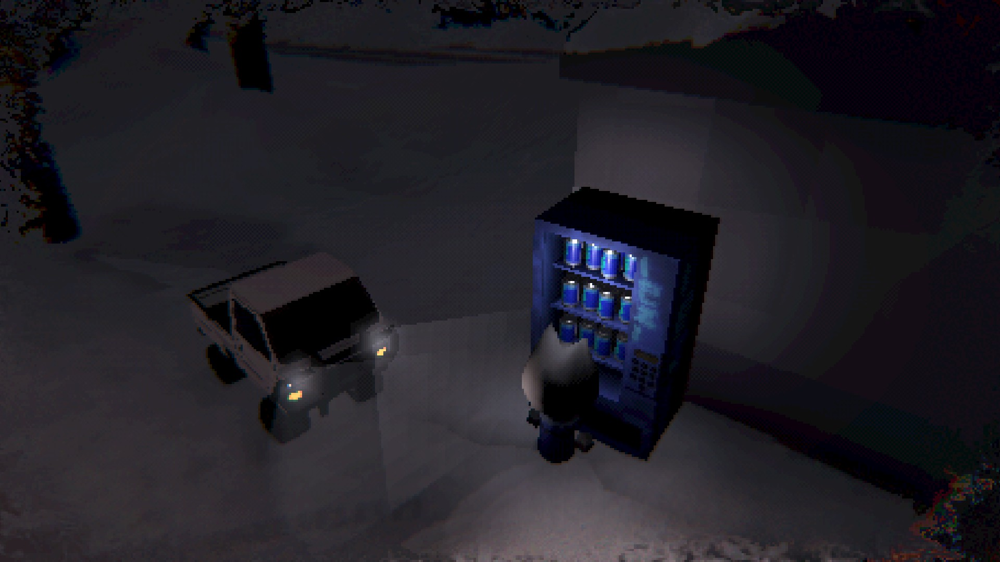
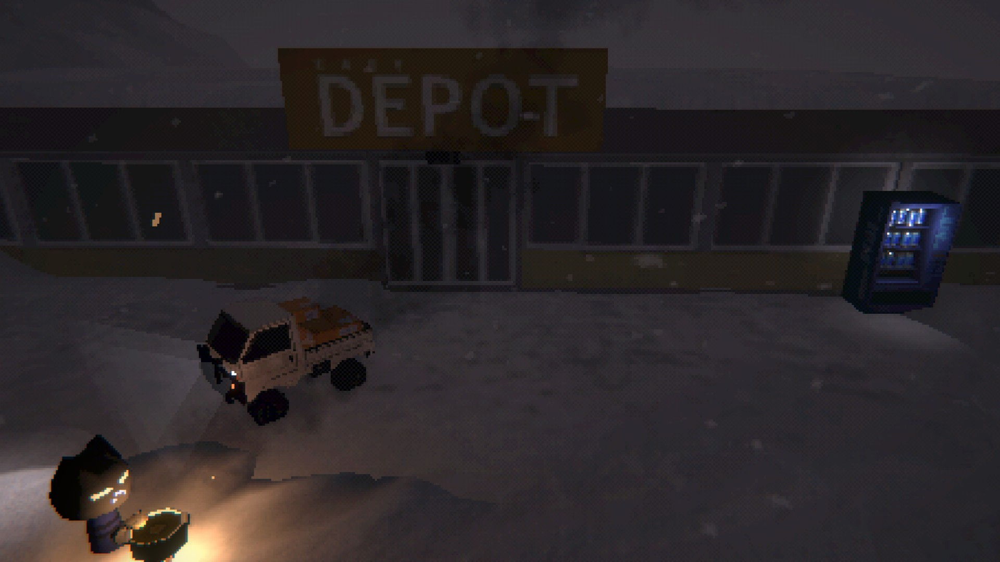
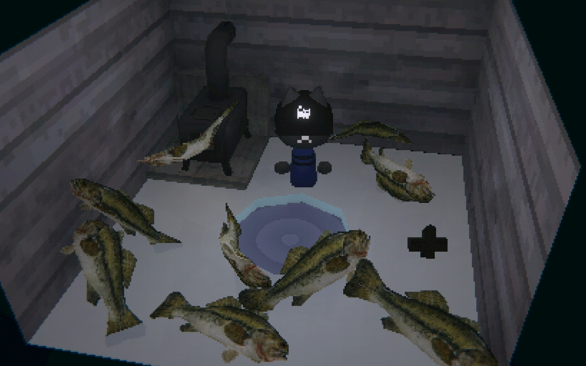

> 理论上这会是一个系列，我会推荐一些我觉得挺好的东西。

Steam上存在这么一类游戏：它们的玩法不会特别重度，也不需要太多操作。硬要说的话，就是那种你在某个夜晚，抱着笔记本电脑窝在床上，怀里塞着抱枕、手边放着薯片，边吃边玩的游戏。我私自给它们起了个名字：Cozy game。

当然是我自创的伪概念。这个分类下的游戏玩法千奇百怪，唯一的共性，或许就是都能带来那种毛茸茸的、让人心率平稳的慰藉感。

---

那么进入正题。今天的主题是Easy Delivery Co.

在这里，你是一只自闭小黑猫，开着一辆重心极其不稳的货车，在一个鸟不拉屎的半山腰城市间送货。

镇上的店主都是各种小猫，感觉像后启示录废土版的《动物森友会》。村里还有一只狗，总是坐在篝火旁慢条斯理地吹着口琴。

“啊，你就是那个新来的吧。”镇民们总是这样跟你打招呼，“或许你就是接替 Seb 的那个人。”

大家都默认你我互相认识，也没人跟你提到底谁是Seb，但是这并不重要。

终端响起，公司发过来几条信息。简单来说

1. GPS坏了，你也看不见你在地图哪，只能知道目的地
2. 车上按Q可以开大灯
3. 最近天气寒冷，请驾驶员在户外注意不要把自己冻死
4. 油费饭钱自己挣

得了，上工吧。

这个游戏的操作非常简单纯粹，四个键开车一个键交互。就算是用手柄，也能非常悠闲的左手开车右手拿薯片吃。

交互也极其纯粹：接单 → 开车 → 装货 → 开车 → 卸货。

但里面夹杂着一些很轻度的生存要素，就像公司提醒你的那样：在车外面待太久能把你冻成冰棍；车没油了，待在车里也会冻成冰棍。这一套反复开车、卸货的流程也确实难为我们的小猫司机——基本上接个几单就得歇会儿吃点东西。

好吧好吧，趁着加油的空档买点能量饮料。结果一看售货机，卖的饮料也是公司产品；再一抬头，加油站也是公司开的。

……不知道是哪个寡头建的这个城。

比垄断更黑色幽默的，是这里的物价与你的工资。且不说油价，花2块钱买一瓶能量饮料只能恢复50%的状态，但在村里辛辛苦苦跑一单，也就挣个八九块。如果是加满一箱油，时价便宜的时候也要50块

可能上一任司机就是这么跑路的吧。

不过随着进度推进，后面有些长途单的报酬就很不错了。在此也不禁和出租车司机共情——短途真的不赚钱。

其他城镇在开始时会被雪、木头或别的什么东西挡住，得自己买个铲子，一铲一铲把路清开。

各个镇子周边还有无线电塔。不管是翻窗进去，还是找门开锁，总之拉下电闸就能听到电台。这游戏的碎核 OST 绝对是上品——开车时伴着引擎的轰鸣声，能在大雪纷飞的悬崖山路上搞出《头文字D》的感觉。还有一个叫 EasyNews 的频道，是那种模糊的、有人在说话的白噪音，很适合放空大脑、慢慢开车时听。

看着那只一直挂着“-ʌ-”表情的小猫，一言不发地、生无可恋地铲雪、烧枯树，还挺有意思的。

日夜更替在送货的旅途中悄然发生。有时候，你从冰湖旁的脚下小城装满货物出发，一路颠簸爬到山顶时，夜幕已经降临。在星空下点燃一堆篝火，煮上一壶茶，坐在被昏黄车灯照亮的雪原中，只能听见风卷起雪花的声音。

非常、非常美好的时刻。

顺带一提，冰湖所在的小镇是个度假村，湖面上散落着几间安静的小屋。在这里，只要花50块钱买一根鱼竿，在冰上凿个洞，你就能坐下来钓鱼了。

钓鱼，是人类游戏史上最伟大的玩法设计。

这其实就引出了一个迷思，现实世界找个班上固然令人心累，但是为什么在虚拟世界被大公司压榨就能让人平静下来呢。

这其实引出了一个迷思：现实世界里找个班上固然令人心力交瘁，可为什么到了虚拟世界，心甘情愿被大公司压榨反而能让人感到平静？

私以为，人类骨子里对“劳动”本身是向往的。我们厌恶的，仅仅是那种日复一日、毫无选择权的异化劳动。就像受命去玩的游戏，便不再是游戏。现实中，我大概这辈子都不会跑到一个人烟稀少的极圈山城去苦哈哈地送货。正因这种绝对的距离感，当我扮演这只工作环境堪忧的小猫时，那些属于打工人的不快感并不真正存在。

我所体会的，是通过一次次送货重新连接各个孤立小镇的充实感，是暴风雪夜里死踩油门穿越山路的紧张，以及连车带货一起滚下悬崖时的那阵傻乐——毕竟，修车的钱又不用我真的掏。

钓鱼系统的精妙之处也在于此。如果这只是一款纯粹的钓鱼模拟器，我想我绝不会如此沉迷。它最美好的时刻，永远发生在你连着扛了20单沉重的啤酒和家具盒子之后，独自驱车前往冰湖，凿冰下钩，最后捞一后备箱的鱼。

钓鱼，为枯燥的送货旅途提供了非日常的新鲜感；而在这座极地小城的送货生涯，又为我身处的现实生活提供了一种非日常的体验。那是一种清冽的、裹挟着雪花与凛冽空气的风味。它足够特别，能将人一把拽进这种略带异常的世界里；但它又足够温和，能让你彻底静下心来，在一片白茫茫中找到柔软的慰藉。

网络在哪看过一个讨论：“如果《死亡搁浅》没有了次世代的顶级画面和豪华演员阵容，它还会是一款好游戏吗？”

我觉得《Easy Delivery Co.》其实默默给出了一个答案。虽然两者的调性与具体玩法不尽相同，但当你在雪山之巅点亮一盏车灯时，它所带来的那种孤独又奇异的治愈感，与山姆穿越美洲大陆时的心境如出一辙。
