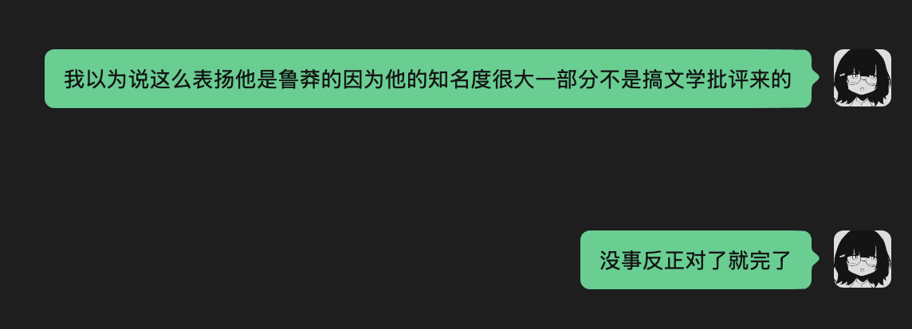
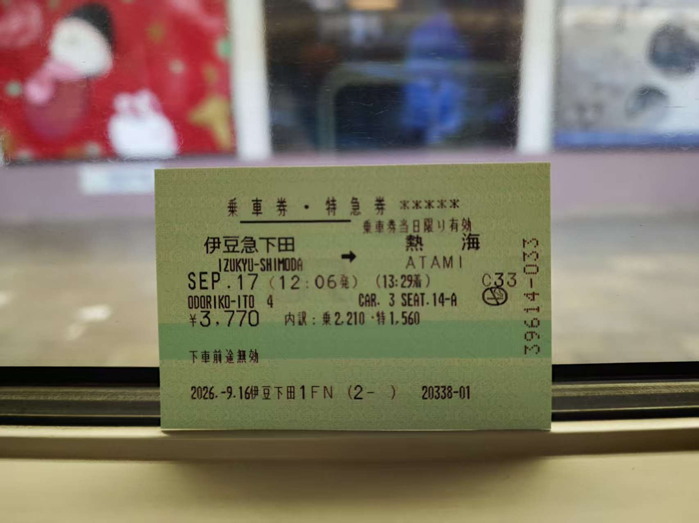
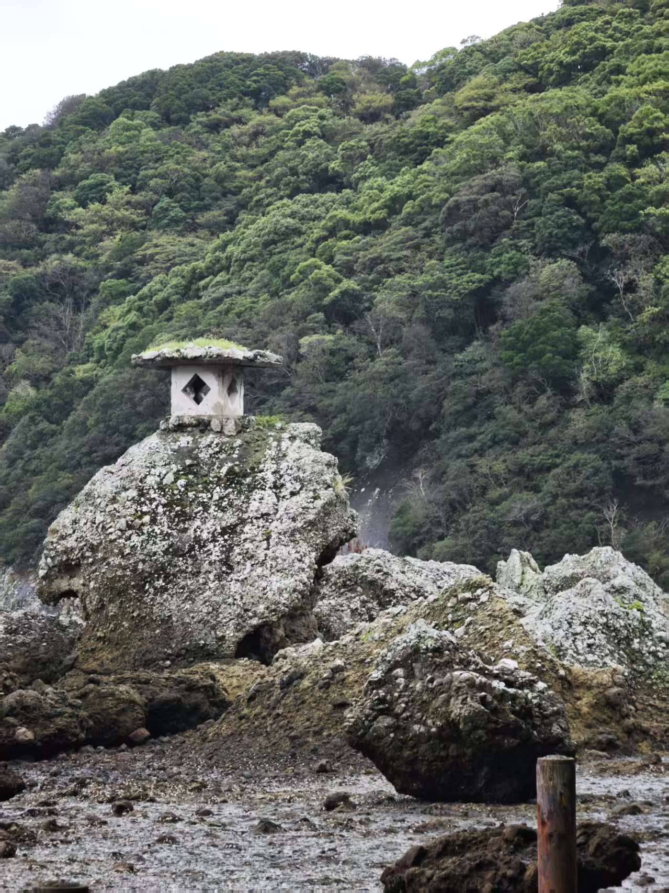
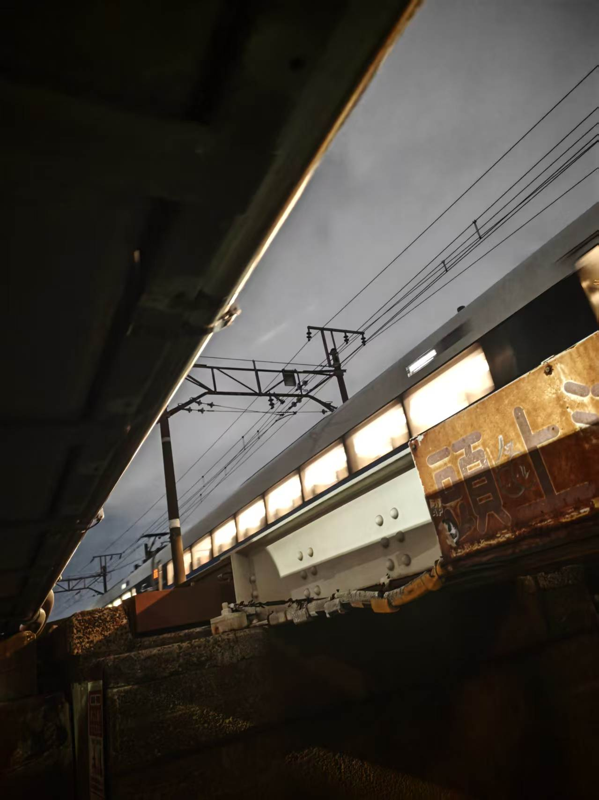

去日本玩了。

其实某种程度上不是我有什么很想去的原因才去的日本，只是朋友邀我想着去一下也不错就去了。

这也是我第一次一个人(?)出国旅行。至少在到住的地方之前确实是一个人吧。

# 01 日本語は全部アニメから覚えた

我从来没学过日语，勉强的说，我在高二之后也没学过英语。

当然，“学语言”实在是一个很模糊的概念。上面说的没学，主要是指我没有再正经花时间背单词、记语法、做诸如此类一般意义上的语言学习。但语言本身倒是一直没从生活里消失：动漫也好，管人也好，The Grand Tour 也好，总归一直在看，一直在听，一直在用。

于是英语和日语在我这里形成了一个很有趣的对照。

英语大概是：先前系统学过一套语法和词汇，然后经历了很多年的持续输入；日语则几乎只有后半截。我没正经学过任何东西，五十音甚至都是看多了之后愣看明白的。

这导致我对日语的感知变得非常奇怪，一定要说，就好像每句话都先被一个特别大的滑窗卷积了一遍：词本身、语气、场景、前后文、对方在干什么、我现在在哪里，以及以前见过的几百个差不多的场景，全部一起卷成了一个高维特征。

然后我是一个参数量有点小的 decoder。

于是很经常出现一种很荒谬的情况：对方说的一句话里可能有一半的词我不知道在说啥，剩下的一半里又有几个我自己根本不会用，但我就是知道他大概在说什么，而且还能给出一个正常的回答。

“日本語は全部アニメから覚えた（我的日语全是看动漫学的）”这话在我这确实是真的，虽然说确实没学多好吧，但是确实能让我在日本作为一个能听懂人话的 gaijin 进行活动。

我觉得语言可能就是这样，在和人交流的层面上，除了词句之外的文化、常识和礼节之类也是对理解至关重要的部分。你走进コンビニ，结账的时候店员问你一个疑问句，就算中间几个词没听清，你也大概知道是在问袋子；在一蘭排队，店员看着你和同行的人问了句话，你甚至只需要听出来一个疑问的语气，就能猜到大概是在问是不是一定要坐在一起；去问一个东西还有没有卖，听到“大変申し訳ございません”，那大概就是卖完了。

沟通似乎就从理解语言变成了理解场景。

但问题也正出在这里：这两件事真的能完全分开吗，所谓的“听懂一句话”，究竟有多少来自词汇和语法本身，又有多少其实来自对这个世界的理解呢？

这似乎像一个反过来的中文屋问题。中文屋里的人拥有字典和规则，却不知道那些符号到底是什么意思；而我在日本的状态有时候恰好相反——字典残缺得要死，规则也只知道个大概，但因为知道便利店是什么、拉面店是什么、店员通常会问什么、人和人在这种场景里应该怎样互动，最后居然还是能把意思拼出来。

当然，如果真的只会「はい」「いいえ」「大丈夫」，那显然还是活不下去。

反正大概是这个意思。

---

对英语的情况，这件事似乎就更难解释一点。前一阵去考 GRE。GRE 的 Verbal 以一种颇为恐怖的词汇量要求闻名，我也认真备考了——大概两个星期。

但因为我以前就从来不背单词，突然让我每天抱着词表开始背也实在背不进去，于是最后基本上就是找了点题做。

结果正确率居然还不低。

虽然七道题里能碰上一道所有选项都认识的就已经谢天谢地了，但七道题往往也能对四五道。甚至偶尔会发生一种更离谱的事情：整句话理解得完全错误，最后答案却选对了。

考试的时候这种情况也没消失。有些题做到最后，我其实并不能准确地说出这个词是什么意思，只觉得这个词感觉不像好东西或者这里应该要一个有点正面的词，这两个读起来比较像。

然后选了，居然对了。

考完之后我想过这是为什么，最后发现很难把这种东西归纳成某条具体的规则。我确实不知道那个词的中文释义，甚至没法给它下一个准确的英文定义，但它在我脑子里似乎并不是完全空白的。

它可能带着一点模糊的褒贬，一点语气，一些曾经见过它的句子，一些和它经常一起出现但我已经想不起来的词，甚至还有它的读音给我的某种莫名其妙的感觉。

也就是说，“不知道这个词是什么意思”和“对这个词一无所知”，其实并不是一回事。

大概语言其实不是一种字典。

一个词也不是简单地对应一个释义。它更像是散落在很多经历里的一个模糊区域：你见它见得越多，这个区域的形状就越清楚。只不过在大多数时候，恰好可以给这个区域贴上一个中文释义，于是产生了一种“我之所以理解它，是因为我知道它是什么意思”的感知。

没贴标签的柜子显然还是个柜子啊。

日语让我意识到，我可以在没有完整词汇的情况下理解一句话；GRE 则让我意识到，我甚至可以在没有完整释义的情况下理解一个词在一句话里应该处在什么位置。

这两件事放在一起还挺奇怪的。

常识上理解应该发生在“知道”之后：先知道词义，再知道句义，最后知道对方想表达什么，但实际上的理解好像没有这么逻辑上通畅。

它更像是很多残缺的信息——词、声音、语法、场景、文化、经验、情绪、以前看过的无数乱七八糟的东西进行合成大西瓜。最后某个东西突然超过了阈值，于是脑子告诉你：

哦，我懂了。

至于到底懂了什么，以及到底是怎么懂的，有时候反而说不清楚。

所以我觉得大家学语言的时候都应该多看点文章和视频。

大概吧。

# 02 新幹線　連絡船　運命線よ教えて

什么时候我能在国内体验日铁的服务啊——

不说别的，把西瓜卡往闸机上一拍，甚至不用减速就能直接走出去，真的很爽。虽然国内用卡过闸其实也挺快的，但高低还是得在闸机前面顿那么一步。如同 30 帧和 60 帧的区别。

其实比起单纯作为一种基础设施，日本的铁道给我的感觉更像是城市本身的一部分。

国内当然也有属于铁路的文化符号，春运、绿皮车、卧铺、漫长的跨省线路，甚至“坐火车回家”本身就是一种非常具体的集体记忆。但日本的铁道给我的感觉又不太一样。可能是因为它实在太密了，密到铁路不再只是把你从 A 点送到 B 点的东西，而是直接长进了城市里面。

于是坐车本身也变成了旅行的一部分。

在新宿站迷路也好，在山手线被人挤到双脚离地也好；坐 JR 踊り子号，一边是富士山，一边是伊豆诸岛也好；在新干线上把腿伸开睡觉然后睡过站也好；凌晨爬起来赶首电関空快速・紀州路快速去机场，坐错车厢差点喜提和歌山一日游也好……

至少对我来说，日本的铁路光是在“乘坐”这件事上，就已经有一种微妙的冒险感。

你当然知道自己最后会到哪。

但中间会发生什么就不好说了。

可能是一个有三十几个出口的车站，可能是突然发现这班车在某一站要拆成两半，可能是站台上出现一串第一次见到根本不知道什么意思的种别，也可能只是某天下午坐在靠窗的位置，突然看到海从房子之间露出来。

铁路在这里不像旅途开始之前和结束之后需要忍受的一段加载时间，它自己就是地图的一部分。

——当然，这部分确实有点抛开价格不谈。

不算新干线和踊り子（日铁迷思之到底要不要买特急券）一个多星期光普通交通我好像就刷掉了快 8000 日元；把新干线算进去之后，更是一个放在国内已经够我买商务座到处瞎坐的数字。

我知道日本整体物价高，但新干线还是贵得有点离谱。甚至会出现“全日空怎么比火车还便宜”的情况。

而且这种“丰富”有时候也会变成另一种意义上的丰富。

比如在大阪换各种 JR 和私铁就相当费劲。阪急、阪神、近铁、南海、京阪、JR……大家各修各的，各有各的站，各有各的入口，然后非常随便点写其他家的线路指示。

但也正是因为这些东西混在一起，日本的铁路才会给我一种很奇妙的、近乎有机的感觉。

它不那么像一个被统一规划好、规规整整铺在城市下面的交通网络，而更像是几十上百年里，一家公司修一点，另一家公司再修一点，城市跟着铁路长，铁路又追着城市继续长，最后互相缠在一起形成的一大团东西。

不过似乎事实确实是这样。

然后你作为一个外来者，一头扎进去。

我在日本最后一次坐 JR，是天还没亮的时候去赶关西机场。

得益于日本过分的城市密度，以及关西机场这个从海里硬填出来的神奇地理位置，那趟首电的体验意外地很好。

刚上车的时候窗外还是黑的。

然后天一点点从黑变成深蓝，电车穿过一片又一片密密麻麻的小楼。越往南走，建筑逐渐变矮、变少，虽然其实也没有少多少，天空却越来越亮。

最后列车驶上跨海大桥。

那一瞬间前面那些挤成一团的城市、轨道、站台和房子突然全没了，窗外只剩下一大片海。天已经亮起来了，车继续向那个浮在海上的机场开。

作为离开日本前看到的最后一个场景，还挺合适的。有一种正在离开某个已经探索完的地图，向着明天和更广阔的可能性前去的感觉。

所以什么时候我能在国内体验日铁的服务啊——

丰富到这种程度大概是不太可能了。毕竟中国的土地尺度、城市结构和铁路承担的功能都完全不同，把两边放在一起比本来也没什么意义。

但是至少把检票速度优化一下吧。

过安检已经很折磨人了，怎么进站还要卡我这一帧。

# 03 僕だけ、かくれんぼ

旅游的“游”，某种意义上似乎也可以理解成「遊び」。

一种暂时从原来的生活里脱离出来，自由地在时间和空间中游荡的行为。

至少对我来说，旅行最重要的东西大概是对新奇事物的一期一会：跑到一个陌生的社会或者自然环境里，然后看看那里究竟有什么自己平常见不到的东西。

这可能也是我和别人出去旅游的时候经常玩不到一块去的原因。

至少在旅行这件事上，我非常抵触把行程计划得特别具体。几点去哪里、几点吃什么、这个景点留一个小时、那个景点拍完照之后坐哪班车走，这种事情光是想想就感觉新鲜感已经提前消耗掉了一半。

当然，从这里到那里这种涉及“今晚到底有没有地方睡”的事情也还是得计划的。

除此之外，比较理想的状态就是随便走。

对很多人来说，旅行或许更多是通过那些有名的地标去感知一个地方：去浅草寺，去富士山，去道顿堀，在那些一眼就能认出来的地方留下照片，于是很多年以后还能证明自己确实来过这里。

这当然也是一种旅行。

只是对我来说，如果我已经在旅游博主的 vlog 里看过一遍，又照着他的攻略把路线完整复刻一遍，那么整个过程总有点像在体验 4D 版旅游 vlog。

缺乏那种接下来会发生什么的部分。

---

下田有一个锅田海岸。

说是海岸，其实其中一段更像是悬崖下面绕着海修出来的一条山道。从路旁往下看，可以看到海里有一块很大的岩石，岩石顶上还留着一个像石灯台一样的东西。

其实站在山上眺望就已经是难得的绝景了。海、悬崖、伊豆那些绿得有点过头的山，还有下面一层一层打上来的浪。

但我一路都在想：那个石头上到底是什么？

所以后来我就直接抛弃了我的朋友（不要这样做），无视了立入禁止的牌子（更不要这样做），从山道翻下去，冲着那块巨石开始沿海岸跋涉。

最后爬上去看到那个石灯台了吗？没有。

甚至根本没走到能爬上去的地方。

但一路深一脚浅一脚地踩着石头过去，倒是看见了被不知道什么动物吃剩下的龙虾壳；被石头上突然窜出来的海蟑螂吓得差点直接跳进海里；钻过被海水侵蚀得坑坑洼洼的崖洞；最后走到巨石下面，还看见了几只不知道叫什么的灰色水鸟躲在那里。

它们藏在石头后面，只能偶尔看到一点灰色的影子。

然后是一阵振翅声。

那时候我突然觉得，好像也没必要再往前走了。

于是我又晃晃悠悠地原路爬回去，用和这个博客里差不多苍白的语言跟朋友说：

“那边有水鸟诶。”

然后他白了我一眼。

---

后来去了大阪。

有天晚上出门吃完松屋，也没什么特别想去的地方，于是就在居民区里乱晃。

穿过几条小巷，拐了不知道几个弯，最后莫名其妙走到了一个限高好像只有一米二的铁道桥下面。

然后好巧不巧，开始下雨，我就蹲在那个一米二高的铁道桥下面避雨。

这是那种如果写进旅行计划里会显得非常傻逼的行程，但那天晚上还挺开心的。

雨没有下很久。等它稍微停了一点，我就继续沿着铁道乱走。走到一个道口的时候，警报突然响起来，栏杆落下，红灯一闪一闪。

然后远处出现了两个白色的车灯。

一列回送的雷鸟号正沿着铁轨向这边开过来。

接下来就是一段完全没有道理的“火车追我然后我追火车”的情节。

最后留下了一张在铁道桥下面拍到的，雷鸟号从相机前碾过去的照片。

我甚至不知道那个地方叫什么。

---

这些地方，至少据我所知，都不曾出现在什么旅游攻略里。

就算出现了，它们所处的诡异位置大概也很难让它们成为“景点”。不会有人专门跑到大阪的居民区里看一个一米二高的铁路桥，更不会有人把“沿着禁止进入的海岸走过去看鸟”写进伊豆三日游推荐路线。

但回头想起来，这些反而是整趟旅行里我记得最清楚的东西。

我不知道那里有什么，所以我走过去看了一眼，然后那里真的有些什么这部分，就像开宝箱一样让人激动啊。

---

感觉某种程度上，这也只是心态的区别。

比如坐新干线的时候，我因为睡过了神户站，睁眼发现车已经开走，只能一路被发配到冈山。

这件事直接导致了朋友对我进行了一段时间的冷暴力。

但我站在冈山站台上的时候其实还挺开心的，几分钟前我甚至没想过自己这趟旅行会来冈山。

列车开走之后，站台突然安静下来。外面是一个对我来说完全陌生的城市，我不知道车站外面有什么，不知道这里的人平常过着什么样的生活，甚至不知道下一班回神户的车到底什么时候来。

只是莫名其妙地，因为睡了一觉，我就站在这里了。

然后查了一下时刻表，走到对面站台，偷偷摸摸坐上希望号的自由席回神户。

虽然确实耽误了点时间。

但毕竟这就是旅游啊。总应该发生点什么的。