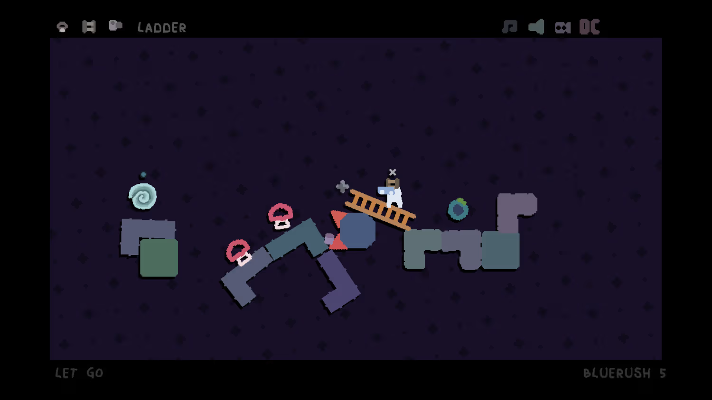
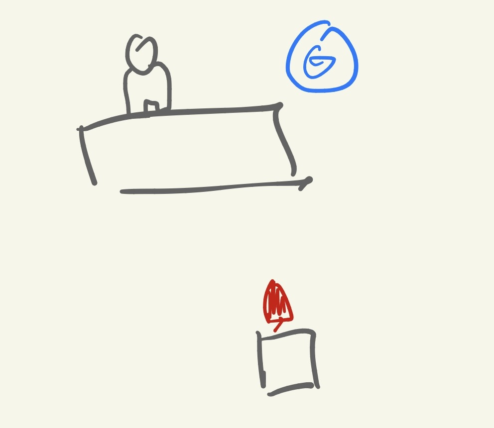
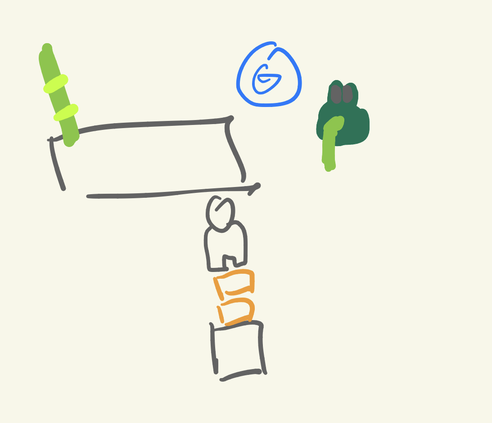
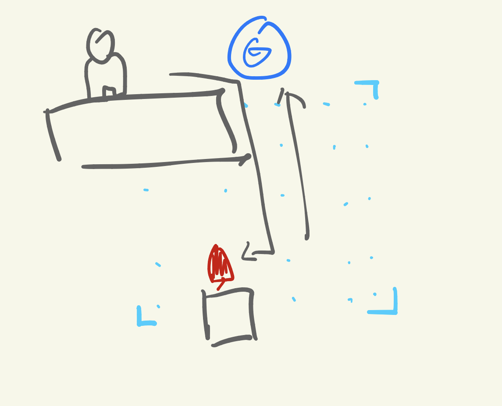

《Mosa Lina》是一款……

呃，某种意义上，它是一款平台跳跃游戏。
但在我看来，这个定义显然有待商榷——我指的是“游戏”这个词，而不是“平台跳跃”。

你想，一般我们聊起电子游戏，概念上高低得包含一个“在设定的规则框架内，通过玩家的操作达成既定目标”的闭环。就算是 Minecraft 这种沙盒游戏，好歹最后也留了一条末影龙供你砍。

Mosa Lina 的目标其实同样清晰：在每一关里，操控主角碰到场景里所有的果子，然后跳进传送门就行。

然而，“通过玩家的操作达成既定目标”这句放之四海皆准的真理，在 Mosa Lina 的体验里，却成了一种薛定谔的概率事件。

---

作者在Steam页面上给这款作品的简介如下：
> “对沉浸式模拟游戏的叛逆式解读，这里毫无章法，但一切运转自如。”

为了防止有读者一头雾水，先做个简单的名词解释。“沉浸式模拟游戏”通常指起源于 System Shock，并由 Prey、Dishonored 以及杀出重围发扬光大的一系列作品（顺带一提，耻辱真的神作，强烈推荐）。这类游戏最大的特色，就是开发者通过精心的关卡布置和自洽的底层系统，让一个任务可以衍生出数种完全不同的解法。

回到《Mosa Lina》上来，它是“对沉浸式模拟的解读”吗？确实是。游戏里的各类道具与关卡设计之间，确实给化学反应留出了巨大的空间。只要条件允许，你能玩出各种神秘的解法。

那么，“叛逆”的部分又体现在哪呢？

这正是这个作品最挑人的地方：每大局由三个关卡组成，开局时你会随机获得三种道具。

**重点在于，关卡是随机的，道具也是随机的。**

也就是说，游玩体验其实完全不可控，运气好的话你奶奶都能用手里的道具打个全通，运气不好的话无论操作，这关就是纯粹无解的。

想象这么一个关，你要做的就是把果子吃了，然后进传送门。

然后你的随机道具是

- 箱子，一组六个，可以垫脚
- 青蛙两只，会跳（并不受你控制）
- 竹子，插地里往上长

另外，这个游戏是不能爬的，大概60度的坡就上不去了，跳跃按起火了也不行。

面对这种地形，这套组合基本可以宣告重开。因为你没有任何获得斜向高度的能力。

但如果换一种可能性呢？比如系统在开局时塞给了你一个叫“力场”的道具——人走进去之后只要拨动摇杆，就能在力场里横飞。

我奶奶来了都能过。

“这里毫无章法，但一切运转自如。”这句话确实如实描述了这个游戏。这里的一切都严格遵循着一套极其自洽的常识性物理法则，但也正因如此，它带来了最纯粹的、让人高血压的混乱。

如果你不是那种在剑走偏锋之后能享受醍醐味的高难度受害者，你大概会觉得：“这不是纯扯吗”

但是别急，作者虽然不负责关卡设计，但他做了一个非常伟大的功能：

## 多人模式。

这个多人模式极其敷衍，对游戏的底层系统没有做任何重构或针对性优化，完全只是在屏幕里多塞了一个玩家，以及多了一份胡闹的物理碰撞。

然而，一旦你接受了这种混乱、甚至带点虚无主义的过关模式，双人模式就会瞬间完成质变，变成纯粹的 Party Game。

在单人模式里，由于随机道具的无解而导致连人带货卡在死角，是一种让人想砸键盘的挫败；但在多人模式里，当你看着联机的死党因为掏出了一个毫无卵用的“青蛙”，结果被乱跳的青蛙一脚踹进深渊时，那种荒诞的喜剧效果就达到了巅峰。

只要不再计较能不能通关（反正作者也不计较），你们开始研究怎么用手里那点可怜的破烂道具把对方送走，或者尝试一些成功率只有0.1%的“人肉火箭”邪道玩法。

---

Mosa Lina 用一种极其极端的方式解构了现代游戏里精密的“喂饭式”关卡设计。它把一切交给了概率，把烂摊子扔给了玩家。

但是真挺好玩的。
