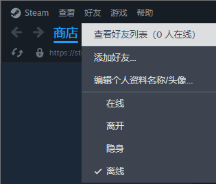
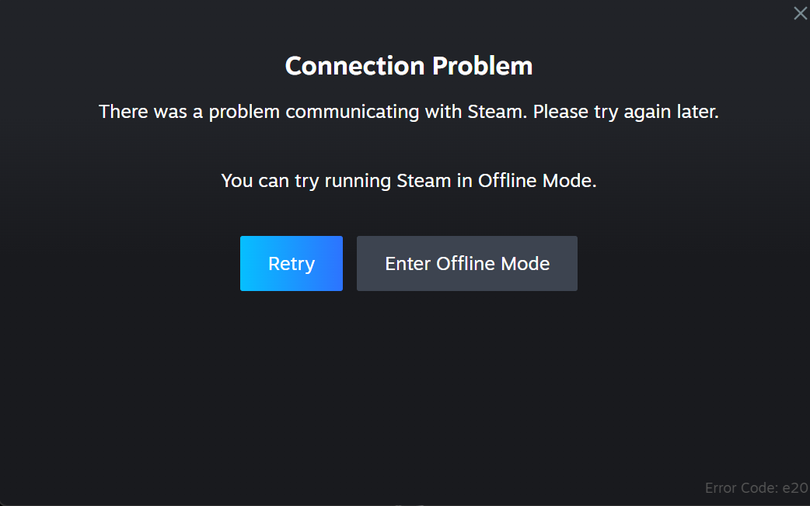
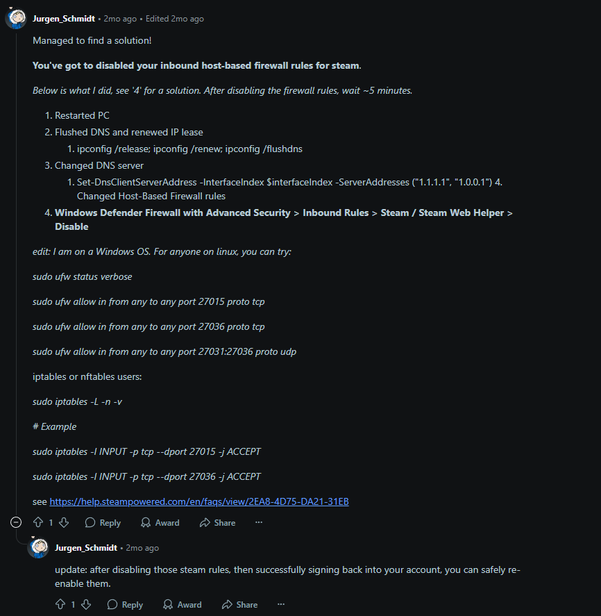
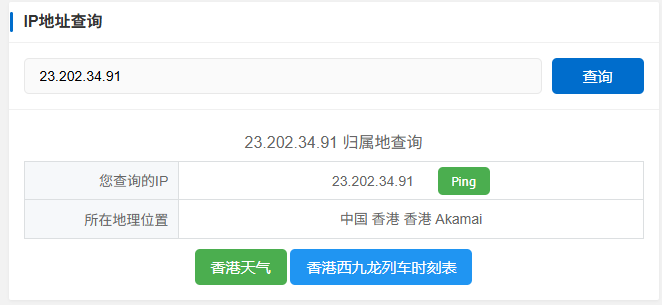
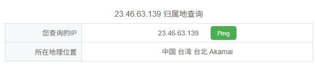

> tl;dr: 把steam302退了就行

### 案发背景
简单来说，从几天前开始我的steam就死掉了，具体表现是连不上处理商店之外steam的所有在线服务（好友/社区 之类的），而且账号状态会被卡在离线无法切换

但是非常诡异的是我的浏览器可以正常的访问steam连不上的服务

之后我干脆把账号退了，然后就再也登不上去了并在右下角看到了 E20 错误提示。

我按常规操作：重启、重置网络配置、清空缓存，问题仍在。搜索网络后发现大量低质量“教程/加速器软广”，无果。最后在 Reddit 上找到一个看起来靠谱的建议：重置 DNS。重置后当时确实连上了，但重启机器后问题又复现了。

> 我觉得在这里有必要批评一下中文互联网对dead internet theory的证实程度，在必应搜素相关问题的时候，所有的打着教程旗号的文章全是机器人写的加速器软广

### 寻找问题

无奈只能使用wireshark进行一些分析，主要关注一些被RST和retransmission的数据包

然后反查IP，看到了这几个Akamai的IP

Steam的主要域名就是Akamai CDN，在国内也是出了名的容易被卡，但是我的电脑长时全局代理，既然浏览器能连上，那没有steam连不上的道理。浏览器能正常访问但 Steam 客户端不行，那问题很可能在本地分流/重定向这一环节。

经过漫长的人生思考，突然想起来状态栏还挂着这个

Steam302的反代确实有重定向Akamai链接的这个功能，而且也不监听浏览器流量，如果有问题，好像也只能是这里了。

### 解决

于是我就把他退了，开机自启也关掉了

然后真的就修好了，重启之后在打开302也一切正常

我怀疑是我某次粗暴的重启打断了302对host的修改，导致host爆炸了，退出之后302用备份的原档还原了host，问题就解决了。

> 虽然这个解释能解释“退出就好了”，但不完全合理 —— 如果只是 hosts 临时错乱，重启理论上也能恢复；
> 
持续调查中……