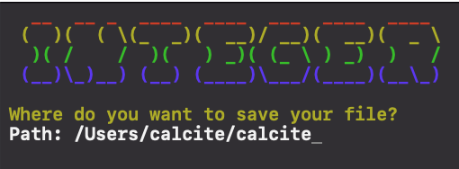

> 应该是本站第一个正经技术博客，但是离建立这个技术博客站已经过去一年了

## 起因

最近在用 C++ 写一个终端放置游戏。既然是游戏，存档功能是刚需。但我很快发现了一个极度破坏体验的地方：存档路径。

肯定不能让用户每次都手写绝对路径，那样也太过分了，于是就有了预留一些输入的需求。用户觉得满意直接按回车，不满意就在此基础上修改。



之前为了实现基本的游戏功能就写了一个非阻塞的键盘监听

```C++
void InputMonitor::initInput() {
    struct termios newt = {};
    tcgetattr(STDIN_FILENO, &oldt);
    newt = oldt;
    newt.c_lflag &= ~(ICANON | ECHO);
    tcsetattr(STDIN_FILENO, TCSANOW, &newt);

    // set non-blocking
    oldf = fcntl(STDIN_FILENO, F_GETFL, 0);
    fcntl(STDIN_FILENO, F_SETFL, oldf | O_NONBLOCK);
}

void InputMonitor::resetInput() {
    tcsetattr(STDIN_FILENO, TCSANOW, &oldt);
    fcntl(STDIN_FILENO, F_SETFL, oldf);
}

int InputMonitor::pollInput() {
    int ch = getchar();
    if (ch != EOF) return ch;
    return -1;
}
```

然后理所当然的觉得，既然输入路径是一个长字符串，那直接回归阻塞然后模拟一下输入就可以了。第一版代码大概就是这样：

```C++
game->setHalt(true);
game->monitor->pause();

...

std::string filePath;
std::filesystem::path cwd = std::filesystem::current_path();
std::string defaultPath = cwd.string();
if (!defaultPath.empty() && defaultPath.back() != std::filesystem::path::preferred_separator) {
    defaultPath += std::filesystem::path::preferred_separator;
}
std::getline(std::cin, filePath);
```

经过一番搜索和考虑一些跨平台的需求，在unix系统上用了[TIOCSTI](https://www.man7.org/linux/man-pages/man2/TIOCSTI.2const.html)，允许进程向终端注入字符，模拟是用户敲出来的。在windows上则使用很丑陋的模拟keyEvent

```C++
#ifdef _WIN64
    HANDLE hInput = GetStdHandle(STD_INPUT_HANDLE);
    for (char c : defaultPath) {
        INPUT inputs[2] = {};

        inputs[0].EventType = KEY_EVENT;
        inputs[0].Event.KeyEvent.bKeyDown = TRUE;
        inputs[0].Event.KeyEvent.uChar.AsciiChar = c;
        inputs[0].Event.KeyEvent.wRepeatCount = 1;

        inputs[1].EventType = KEY_EVENT;
        inputs[1].Event.KeyEvent.bKeyDown = FALSE;
        inputs[1].Event.KeyEvent.uChar.AsciiChar = c;
        inputs[1].Event.KeyEvent.wRepeatCount = 1;

        DWORD written;
        WriteConsoleInputA(hInput, inputs, 2, &written);
    }
#else
    for (char c : defaultPath) {
        ioctl(STDIN_FILENO, TIOCSTI, &c);
    }
#endif

```

一言以蔽之TIOCSTI能直接往终端发送字符串，塞进cin的缓冲区里。不过这个设计有很多神秘的问题，比如默认路径`/Users/calcite/calcite` 会被读成 `Users/calcite/calcite`

刚开始怀疑是缓冲区没清空之类的问题，索性加了一行清空，然后就变成了`/sers/calcite/calcite`

只能说是非常神秘，疑似是因为 TIOCSTI 注入的速度极快，且异步于 shell 或程序的 cin 读取。当程序还没准备好接收输入，或者终端驱动在处理特殊字符（如 /）时存在竞争之类的。

经过一番搜索，没找到有类似问题的人，但是找到了这个[issue](https://github.com/dvorka/hstr/issues/531)
大概来说，就是这个功能实在是有够危险，所以被很多linux发行版和mac弃用了，既然OS没有明确支持，那感觉也没必要在mac上死磕了。

作者提了bash和zsh可以用shell函数，自然的想到了bash的历史命令功能，按了上键就能改之前的命令。

那么是怎么做到的呢？

搜了一下，大概来说终端其实并没有真的等你输入然后把缓冲区打印出来，只是在按下键盘之后实时的更新了一下缓冲区的字符然后

“假装是打印缓冲区的字符”

基于这个思路写了一个自定义的readLine，不再依赖内核注入，是在用户界面层“伪造”了一个输入过程：

```C++
std::string InputMonitor::readLine(const std::string& prompt, const std::string& defaultInput) {
    struct termios oldt = {}, newt = {};
    tcgetattr(STDIN_FILENO, &oldt);
    newt = oldt;
    newt.c_lflag &= ~(ICANON | ECHO);
    tcsetattr(STDIN_FILENO, TCSANOW, &newt);

    std::string buffer = defaultInput;
    std::cout << prompt << buffer << std::flush;

    while (true) {
        char ch;
        if (read(STDIN_FILENO, &ch, 1) > 0) {
            if (ch == '\n') { // Enter
                std::cout << std::endl;
                break;
            } else if (ch == 127 || ch == '\b') { // Backspace
                if (!buffer.empty()) {
                    buffer.pop_back();
                    // Move cursor back, overwrite with space, move back again
                    std::cout << "\b \b" << std::flush;
                }
            } else if (static_cast<unsigned char>(ch) >= 32 && ch != 127) {
                buffer += ch;
                std::cout << ch << std::flush;
            }
        }
    }

    tcsetattr(STDIN_FILENO, TCSANOW, &oldt);
    return buffer;
}
```

然后就好了。
