> 本文是对 va-11 hall-a 主创 Fernando | IronicLark 的博客 Still In Love – Denpa as a genre, and the desire for acceptance
的翻译，原文发布在[他的个人博客](https://umadacchidensetsu.com/still-in-love-denpa-as-a-genre-and-the-desire-for-acceptance/)

译注：相关内容可能有不符合原意之处，里面提到的游戏我好多都没打过。

:::tip
以下博文会涉及色情与暴力话题。并无直接的血腥、裸露内容或描绘此类内容的图片，但文章中会包含上述主题。此警告仅作以防万一的目的，因为这系列博客目前仍保持着令人震惊的PG-13级

这篇博客同时也是[对爱如往昔的生涯总结](https://umadacchidensetsu.com/still-in-love-love-saves-love-dooms/)的后续/伴生文章，以防你对这几篇之间的联系一无所知。
:::

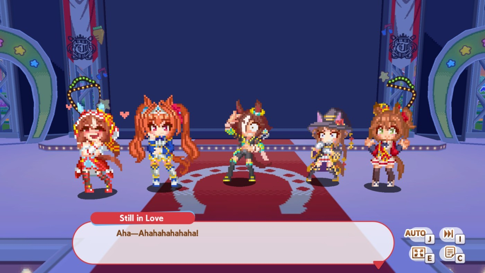

在热血喧闹大感谢祭发售和爱如往昔实装的那一阵子，我也错误的觉得她就该是个病娇人设。现在看来我是对膜愚蠢，她的实际性格来自一个迷人且有趣的多的主题。

不过，要想真正理解这一点，我得稍微岔开一下话题，像往常一样，我恳请大家耐心听我讲完。希望到最后，这一切都会变得合理起来。

---

1981年6月17日上午11时35分至11时40分之间，一名在记录中仅被称为“K.G.”或“K”的男子持刀刺伤了一名27岁女子，其1岁儿子和3岁女儿，致三人全部死亡； 另有1名33岁女性因腹部遭刺身亡，1名71岁女性受重伤，以及1名39岁女性同样受重伤。

事后，K袭击并持刀威胁了一名32岁女子，随后将自己反锁在附近的一家中餐厅内。直到下午6点55分左右，这名被挟持的女子才找到机会逃脱，当局随即突击进入并最终将其逮捕。

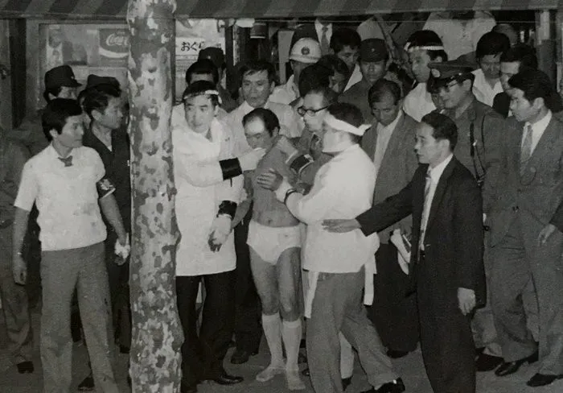
“K”被伪装成寿司师傅的警员逮捕（来源：namuwiki）

这起被称为“深川刺伤事件”或“深川街谋杀案”的案件震惊了日本。令人震惊的不仅是看似毫无征兆的残暴行径，也不仅是K被捕时身穿内衣、嘴上裹着毛巾以防咬舌。我想要重点探讨的部分，也是我为何要如此粗略地概括此案的原因，在于K在庭审中声称是“无线电波”迫使他犯下罪行。

电波，電波、ダンパ，电磁波。

这起案件将如此的概念刻在了日本的集体意识中，但正如精神病学家[松本俊彦所指出的](https://web.archive.org/web/20200816130732/https://president.jp/articles/-/26708?page=2)：把迫害妄想归咎于“电波”，并不是K凭空发明的新词，早在该事件发生之前，患有类似精神问题的人群就已经在普遍这么声称了。

此外，为了在不过度偏离主题的前提下尽可能做到严谨，我需要指出的是，K在案发前很久就已经精神不稳定了。事实上，他当时之所以随身携带一把柳刃包丁，是因为他想找一份寿司厨师的工作，却屡屡碰壁；于是他坚信，这是所有寿司店联合起来针对他的一场阴谋。[维基百科上对他的背景有着非常详尽的概述](https://ja.wikipedia.org/wiki/%E6%B7%B1%E5%B7%9D%E9%80%9A%E3%82%8A%E9%AD%94%E6%AE%BA%E4%BA%BA%E4%BA%8B%E4%BB%B6)，即使是通过机器翻译也能看懂大意。

讲到这里，有些从作为音乐流派的电波认识这个词的读者可能会感到疑惑，你们也许还了解与其相关的亚文化，比如“Menhera”之类。如果真是这样，请先把这个想法放在一边。

不论如何，就像上面写的内容所暗示的，这一流派的诞生不仅源于该事件引发的恐惧，更是为那些怀有相似阴暗情绪并对此感同身受的人们提供了一个宣泄的出口。

下文我将进行粗略的，非常**粗略的**简化。因此，如果你想了解更多背景，我建议你去看看 Amelie Dorée 对《Moon.》和《雫》写下的评测，以及 Ontheones 撰写的关于这一题材的博文。

<iframe width="100%" height="468" src="https://www.youtube.com/watch?v=YgXLfiJjmpo" title="YouTube video player" frameborder="0" allow="accelerometer; autoplay; clipboard-write; encrypted-media; gyroscope; picture-in-picture; web-share" allowfullscreen></iframe>

<iframe width="100%" height="468" src="https://www.youtube.com/watch?v=fQfxFULhPzU" title="YouTube video player" frameborder="0" allow="accelerometer; autoplay; clipboard-write; encrypted-media; gyroscope; picture-in-picture; web-share" allowfullscreen></iframe>

::link{url="https://ontheones.wordpress.com/2019/06/29/on-denpa-a-guest-article-by-kenji-the-engi/"}

对于整个讨论，我想补充的一点是，我能精确指出三种互不相同、甚至可以明确作为独立个体存在的“电波”流派。

我们在这里重点讨论的是作为文学流派的电波。这个流派充斥着各种“害怕失去自我控制”的故事，同时又对“如果你真的失控了会怎样”带着一种病态的好奇心。

除此之外，我们还可以区分出作为角色属性的电波。你大概率见过这类人：角色看起来脑袋空空的、空灵脱俗，同时极其明显地带有自闭症谱系的特征，而所谓的“电波”元素，则被解释为他们与某种“更高层面的存在”建立了解析度极高的精神链接。

最后，是作为音乐风格的电波。关于这一点，最典型、最触手可及的例子莫过于本企划（译注：指《赛马娘》）自家的《马儿跳传说》。这首歌的诞生过程极其离奇——曾创作过《特雷森音头》以及《合金装备V：幻痛》神曲《Sins of the Father》的知名作曲家本田晃弘，在连续听了大约1000首电波歌后写出了初版，结果却被上头吐槽“电波味儿还不够浓”。于是他直接把自己灌得酩酊大醉，在家里只穿着内裤，就这么神智不清地编出了这首歌的所有舞蹈动作。

在之后的推文/文章中，我们会专门聊聊“角色属性”的电波，但眼下，我们的核心依然是“作为文学/游戏流派”的电波……然而，我们刚要开始就遇到了一个棘手的问题。

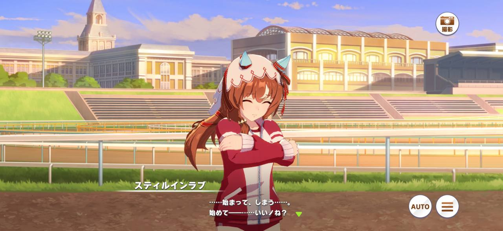

形式是会演化的，其背后的风味和代表的思想会随着时间变动。虽然一个流派的大致轮廓与它理应具备的核心精神总会留存下来，但其细节总会模糊甚至引起争论。

推动电波系发展的是对无征兆暴力的恐惧？抑或是对失去自控的恐惧？是对可以安全的放任自己发疯的渴望？是对疯狂的怜悯，还是对疯狂的释放？

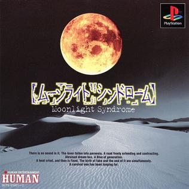

《月光症候群》和《银色事件》的灵感，正是来源于对“究竟是什么导致了那种爆发性的随机暴力”的恐惧。

《沙耶之歌》则讲述了一个早已彻底疯狂的人，如何在疯狂中寻找慰藉，全然不顾对他扭曲视界之外的现实世界造成怎样的影响。

而《素晴日》里包含了大量关于“当世界即将毁灭时你该何去何从”的探讨，更不用说它的前作《终之空》本身讲的就是那些从一开始就打算亲手带来世界末日的人。

但紧接着，你就会开始思索其他同样带有这些元素、却又无法完全融入上述那些宽泛定义的故事。

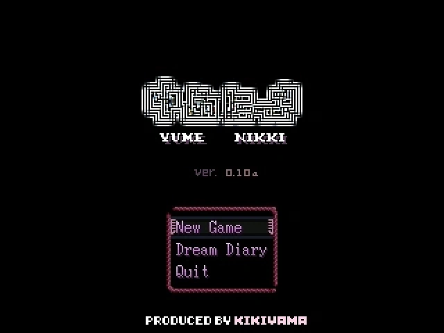

《梦日记》似乎带有焦虑和精神扭曲的元素，但却唯独没有“受到外在因素控制”的要素。

《月姬》本身倒不一定算得上是电波系，但志贵本人显然带着极为浓厚的该流派基因——他那能够斩断万物的能力，曾一度将他逼向精神失常的边缘。

《命运石之门》具备那些被迫害妄想的元素，在原版游戏中，凶真的内心独白要是放进电波系作品里也毫无违和感，然而这部作品的整体基调却又并不那么契合。

那么，《收割者》算电波吗？《梦幻网络》呢？《毁灭邮差》又算不算呢？

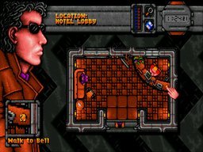

草，甚至有人认为“电波”作为一种流派已经消亡了。但我倒觉得，说电波不复存在，就跟说傲娇的角色绝迹了一样荒谬。它们依然存在，只是除非你刻意去致敬或唤醒它们，否则它们早已化作一块块碎片，融入了其他各种流派更宏大的马赛克拼图中。

而且，你想知道这一切最搞笑、也最讽刺的部分是什么吗？

如果你现在问我，电波系的本质归根结底究竟在传达什么，我会把爱如往昔作为最好的例子指给你看——它完美诠释了这个流派最终想要表达的一切。

让我们进入总结的部分。

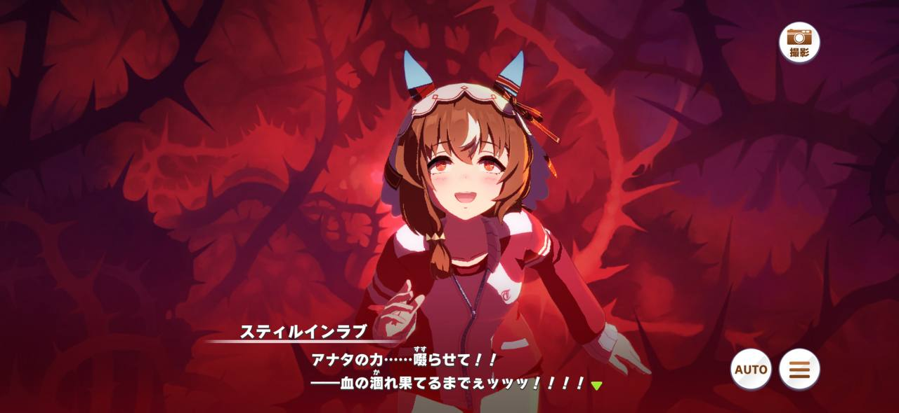

她本是如此内敛、沉静、毫无存在感。那种甚至会因为吃得太慢、只能眼睁睁看着冰淇淋融化而不知所措的女孩；在大多数人眼中近乎透明，甚至还会遭受一些不加掩饰的冷眼的女孩。然而，就是这样一个女孩，体内却裹挟着暴烈至极的冲动。那是一种对竞争的渴望，一种想要将对手彻底蚕食鲸吞、直至寸草不生，并在捕食更多猎物前尽情沐浴在荣耀之中的嗜血本能……可她偏偏又对这样的自己深感羞耻。毕竟，这与她平日里温良的形象大相径庭，是如此的粗暴而残忍；但与此同时，沉溺于其中、将其宣泄出来、彻底迷失自我的过程，却又是如此的令人高潮迭起、欲罢不能。

就在这时，她的训练员出现了。这个人被爱如往昔彻底勾去了魂魄，不仅会像呵护娇嫩的花朵般对待她，甚至会一路护送她回宿舍。但更重要的是，这个人同样目睹过她那更凶狠、更暴烈的一面——而他们不仅没有感到排斥，反而觉得那样的她同样令人神魂颠倒。

这种欣赏并没有凌驾于“日常的往昔”之上，甚至也不是“包容了往昔暴烈一面”的妥协。不，她的训练员同时接纳了那个安静的爱如往昔与那个凶残的爱如往昔。这个人给了她保证，告诉她：她完全可以放任自己堕落，完全可以释放体内的野兽；而当一切尘埃落定，这个人不仅会守候在原地，更会为她献上祝贺，甚至在背后推波助澜。

于是，这种关系本身便演变成了一种执念。他们成了彼此的催化剂，互相拖拽对方在“疯狂”的深渊中越陷越深。对于他们而言，彼此就是生命中的唯一。既然如此，在二人世界之外发生的一切，又与他们何干？

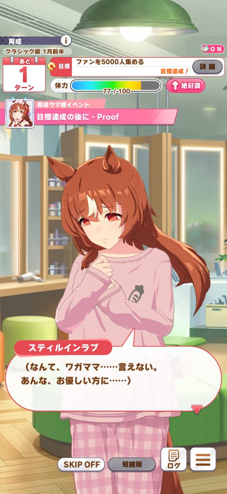

而且，如果你允许我在这里分享一段极其私密的个人心路历程，爱如往昔其实在某个非常特定的层面上深深击中了我，而这段经历正好能进一步阐明我前面的观点。如果你不太想看h的部分，可以直接跳到后面那张看起来有些维和的爱丽数码的图片那里。

是这样的，我一直觉得自己是一个性情非常温和的人。在我的观念里，“不”这个字是最神圣不可侵犯的；无论在身体上还是精神上，我都将“边界感”视作不可触碰的圣条，我甚至可以说自己是一个强迫性的“讨好型人格”。然而（这里我会尽可能说得宽泛且干净），在性观念的层面上，我发现自己其实最容易被那些“强迫性”的幻想所吸引——也就是在第一人称视角的幻想中，将对方置于顺从、甚至通常是“非自愿”的境地中。

而我的这一面，曾经让我感到深深的恐惧。

我并不是一个封建保守的人，我也压根不担心自己会失控并把这些幻想带入现实（我的双脚可是牢牢踩在现实泥土里的）。我只是单纯地觉得……丑陋。确实，每当有游戏允许我体验这种桥段、或者有故事涉及这类情节时，我都会感到爽到飞起；但爽完之后，我总会担忧。这是不是我内心某些未被正视的心理问题的投射？我在某些特定类型的男性身上看到过这种倾向，那场面可一点都不体面，更不用说这种倾向还正好勾连起了我对自身“男性化特质”本就存在的一些过不去的坎……而且，一个平日里的“讨好型人格”居然在幻想里渴望绝对的掌控与支配，这听起来是多么的陈词滥调啊？

不过最终，我开始逐渐与自己的这一面达成和解。这在一定程度上是因为我意识到，这不过是我原本就存在的、向外延伸的利他倾向一种滑稽的变体罢了（“我喜欢看到别人爽”推演到极致，就变成了“就算我必须剥夺你的自主权，我也一定要让你爽到”）。同时我也记起了，在相互自愿的BDSM/支配关系中，“被支配者”其实才是那个真正掌控节奏的人（我再次重申：现实不是法外之地）。当然，最后也少不了我对自己的一句：“你听起来就像那些你最讨厌的卫道士，你这傻逼。”

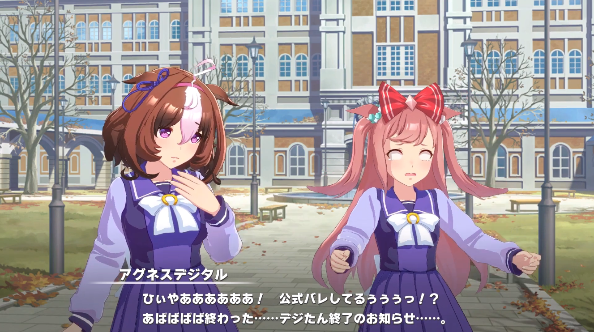

所以，试想一下当这个角色被实装时，我有多么的震惊——她不仅全方位地向那个我珍视至极的流派致敬，而且她的身上几乎承载着与我一模一样的自我怀疑。更好的是，她给了我一个近乎奢侈的幻想：你终归能找到那个人，对方不仅能全盘接纳你体内这种割裂的二面性，甚至会将其视作你身上的一种独特之美。

那么，你想知道为什么“电波”会成为我如此珍视、近乎视作本命的流派吗？因为我本身就是一个精神病，我的一生都在与我自己的大脑战斗。

在9岁那年，我开始过早地意识到（谢天谢地不是通过什么直接的惨痛经历）这个世界可以有多么的糟糕，以至于在这个世界上，似乎没有任何美好的事情发生，也没有任何温暖值得去庆祝。

在10岁那年，每一个多云的日子都会让我的内心充斥着一种无法用理智解释的生存恐惧。当时唯一支撑着我去和自己残破的大脑对抗的，只有我母亲一遍又一遍的安抚：“\[我\]没有疯。”

在13岁那年，我陷入了我是否真的存在的虚无中无法自拔。为了感知到自己的存在，我开始用力将指甲死死抠进手臂的肉里——这个通过疼痛来寻找现实感的动作，最终变成了一个伴随我多年的习惯性抽搐。

在15岁那年，我把越来越多时间花在逃进自己的脑海世界里。在那里，我可以凭空捏造出那些我真正想要共处的“朋友”，而不是勉强自己呆在班级同学的周围。因为我很清楚，一旦我落单，所有人都会围过来问：“嘿，你为什么一个人呆着？你没事吧？”——这种虚伪的社交关切，对我而言实在是太耗费精力。

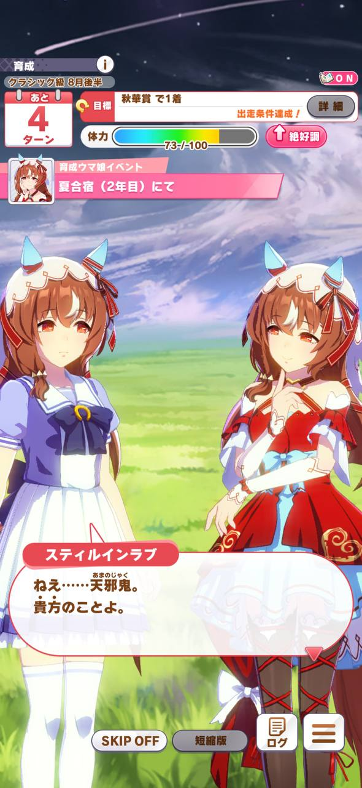

更不用说，我还长期遭受着强迫性思维的折磨，再加上当时尚未确诊的注意力缺陷多动障碍，这一切让我觉得自己对大脑根本毫无掌控权。我的脑袋里永远“嘈杂不堪”，塞满了各种甚至不像是属于我自己的古怪念头。

即便到了现在，作为一个多少比以前活明白了一点的成年人，我也唯有通过将自己的精神“一分为二”——在内心深处分裂出另一个自我，用我对待他人的温柔和包容来对待我自己——才勉强建立起了一丝自我价值感。正如任何读过我个人博客的人所能看到的那样，我至今每天仍在和自己的大脑贴身肉搏；不过好在，现在的情况已经从当年单方面的折磨，演变成了一场势均力敌的JOJO式的替身战斗。

所以，这是一个完美映射了所有这些恐惧的流派：对这个糟糕世界的恐惧、对失去自我控制的恐惧，以及那些挥之不去的终极质疑——“如果我此时此刻其实正坐在垃圾堆里生吞老鼠，而我脑海中的‘坐在电脑前写文章’不过是我彻底疯掉后的妄想呢？”

然而，正是在这些作品中，我看到了那些创作者们对于“在一个注定疯狂的世界中寻找宣泄”的深刻反思。那是属于我们这种精神疾患者的故事，故事里的同类在彼此身上找到了容身之所，他们要么达成了和解与平静，要么找到了一种能够尽情沉溺于自身疯狂之中的宿命——无论结局是什么样子的。

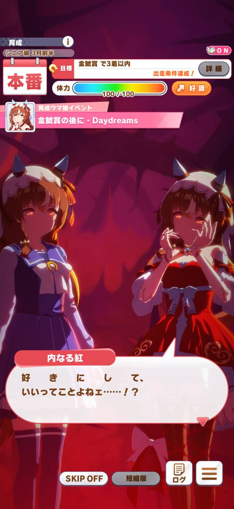

世界残酷且荒诞，总体来说所有人都是脑子有问题的疯子。那如果世界拒绝了我们，我们也抛弃这个世界好了，再造一个我们的世界，为了我们所有人，在我们所有人之间寻找那个我们的归属。

超越被迫害妄想，超越精神问题，超越对失去自我控制的恐惧。“电波”流派的核心本质，讲述的其实是一种无休止的拉扯：你觉得自己在这个世界上根本毫无立足之地，而来自内心深处的，与来自外部世界的同样令你感到惶恐绝望；即便如此，你也仅仅只是想要拥有一块完全属于自己的容身之所，无论多么渺小，又或者多么扭曲。

而这种被提炼至纯的精神内核，恰恰被爱如往昔完美地具象化了。一则属于新时代的“电波怪谈”，一个对当那些骇人的伪装褪去，我们究竟还剩下什么的自问自答，也正是在这个探寻的过程中，它毫无保留地向我们展示了那颗正热烈跳动着的、并在冥冥之中将整个电波流派或多或少地紧密相连的赤子之心。

……顺便，如果你觉得我突然扯到性癖和性欲上面显得太生硬了，我可以明确告诉你，我其实绝不是那种动不动就会把事情往“性暗示”上联想的人。之所以会提这一茬，纯粹是因为在《赛马娘》里，爱如往昔的个人剧情对这方面的暗示已经直球到了极致，如果不是因为这游戏的底线摆在那，他们肯定就把“她和训练员已经做过了”直接写在脸上了。

哥们，只要你对电波系视觉小说这个流派稍微有一点了解，你在跑剧情的时候就完全能……一眼看穿那个极度清晰的轮廓：如果这游戏不是为了照顾PG-13的年龄分级，这地方绝对会直接插入一段重度猎奇向的精神污染肉戏！

这写得简直太妙了！我真想亲口把想出这个剧本的每一个死宅编剧都给狠狠亲上一遍。